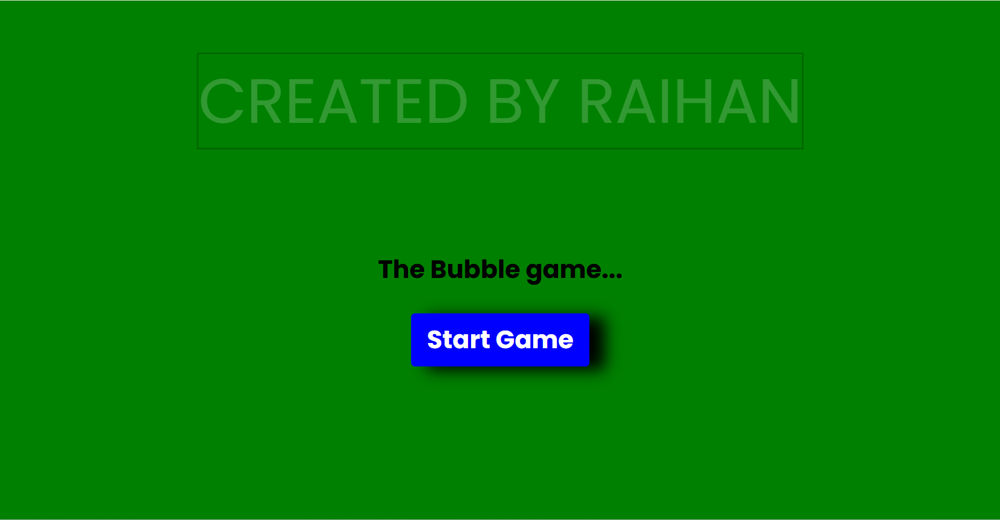
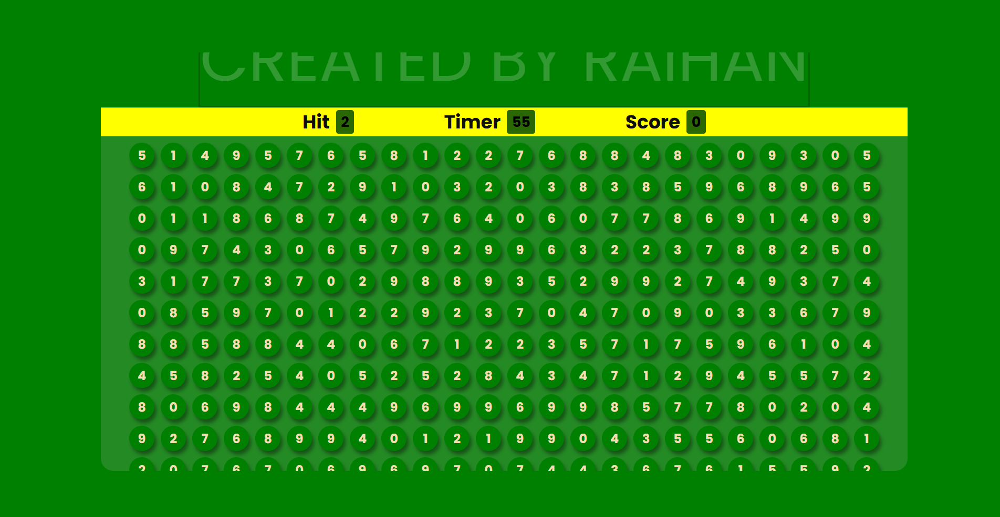
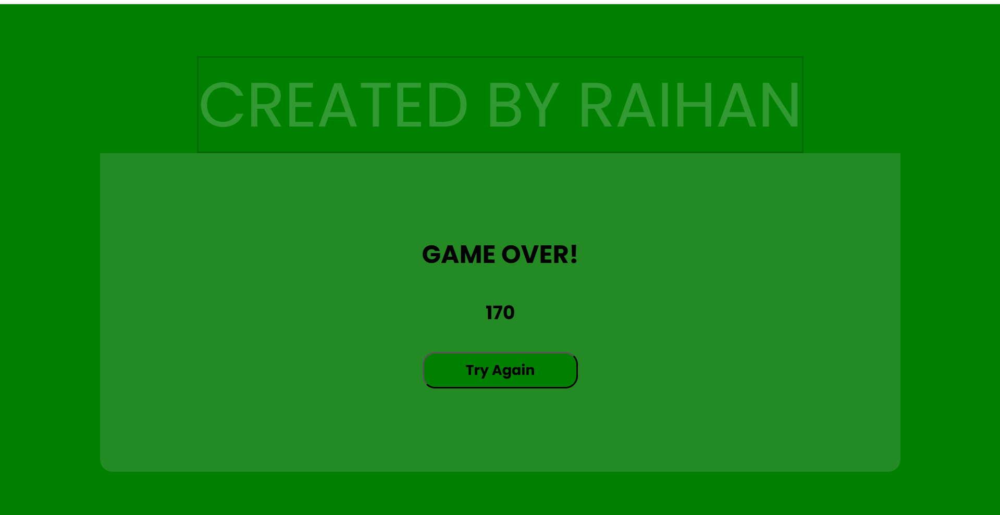

# Bubble_Game 
🎈 The Bubble Game 🎮 The Bubble Game is a fun and interactive number-based bubble-popping game where players aim to hit the correct bubble within a time limit to score points.   
🔥 Features: 
✅ Engaging Gameplay – Pop the correct bubble to score points and extend your time. 
✅ Dynamic UI – Responsive design with smooth animations. 
✅ Sound Effects – Exciting sound effects for correct hits, mistakes, and game over. 
✅ Timer Challenge – Race against time to achieve the highest score. 
✅ Game Over Screen – Displays final score with an option to retry. 

🚀 How to Play? 
1️⃣ Click the Start Game button. 
2️⃣ A number appears under "Hit" – find and pop the bubble with that number. 
3️⃣ Correct hits add time and increase your score. 
4️⃣ Wrong hits reduce time and deduct points. 
5️⃣ Keep playing until the timer reaches 0. 
 
🛠️ Technologies Used: 
HTML – Game structure 
CSS – Styling & animations 
JavaScript – Game logic & interactions 
🎧 Sound Effects: 
Start Music 
Correct & Wrong Sound Effects 
Heartbeat Sound for last 10 seconds 
Game Over Music 
📸 Screenshots 

🏠 Home Screen 

 
🎮 Gameplay 

 
💀 Game Over 

